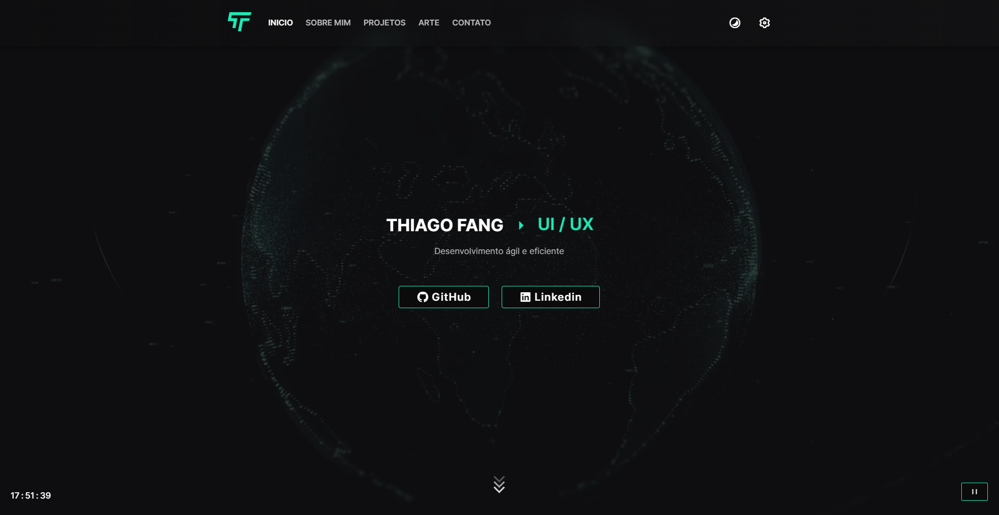

# **PERSONAL PORTFOLIO**

## &#127919; **About**

Meu Portfolio para 2023, aqui vão ter informações sobre mim e meus projetos.

## 📋**My Experience**

Esse pode ser chamado até agora de o melhor dos meus projetos pessoais, aqui consegui usar toda a experiência que adquiri com mais de um ano de estudos e alguns meses trabalhando.

## 🔧 **Techs**

- REACT
- TYPESCRIPT
- STYLED COMPONENTS

## &#127775; **Features**

&#10004; Layout 100% responsivo &#10004; Site interativo &#10004; Personalização: O usuario pode trocar a cor principal do site para a que ele quiser &#10004; Site disponível em duas linguas diferentes

## <a target="_blank" href="https://thiagosilvaportfolio.vercel.app/">**Clique aqui para visitar o Projéto**</a>

